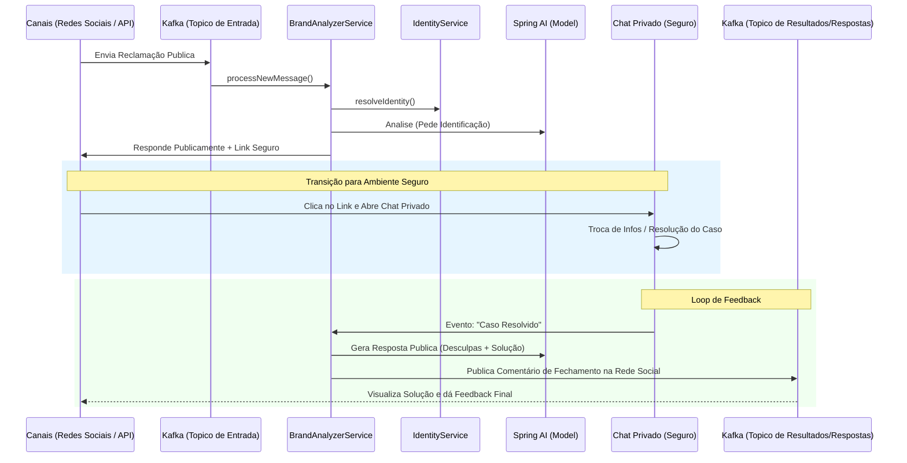

# 📉 Diagrama de Fluxo Detalhado: Brand Analyzer

Este documento descreve o fluxo de dados ponta-a-ponta do sistema **Social Media Brand Analyzer**, desde a entrada da mensagem até a geração do insight de negócio.

## 🌀 Fluxo Geral do Sistema (Mermaid)

---

## 🔍 Detalhamento dos Componentes

### 1. Ingestão e Mapeamento
*   **API/Kafka**: Recebe dados brutos. O sistema mapeia a `Platform` para um `ChannelType` interno (Ex: "Instagram" -> `INSTAGRAM`).
*   **Initial Save**: A mensagem é persistida no banco de dados para garantir rastreabilidade antes do processamento.

### 2. Resolução de Identidade (`IdentityService`)
*   O sistema verifica se o par `(brand_id, platform_user)` já existe.
*   **Lógica de Confiança**: 
    *   `VERIFIED`: Usuário com conta vinculada. Acesso total ao histórico no RAG.
    *   `UNVERIFIED`: Usuário novo ou anônimo. A IA é instruída a **não** expor dados sensíveis e sugerir vinculação.

### 3. Recuperação Dinâmica (RAG)
*   Utiliza o **`QuestionAnswerAdvisor`** do Spring AI.
*   **Isolamento Multi-tenant**: A busca vetorial é restrita por metadados (`brand_id`) e pelo `customer_id` resolvido. Isso garante que a IA da Marca A nunca receba contexto da Marca B.

### 4. Processamento de IA (`ChatClient`)
*   **Prompt System**: Combina as instruções personalizadas da marca com regras de segurança globais.
*   **Output JSON**: A IA retorna obrigatoriamente um objeto estruturado, que é validado e parseado pelo `ObjectMapper`.

### 5. Persistência e Notificação
*   O resultado da análise (`AnalysisResult`) é vinculado à mensagem original.
*   **Evento de Saída**: O resultado é publicado em um novo tópico Kafka, permitindo que outros sistemas (como dashboards de CRM ou Atendimento) reajam à análise instantaneamente.

---
📅 **Última Atualização:** 2026-02-16
